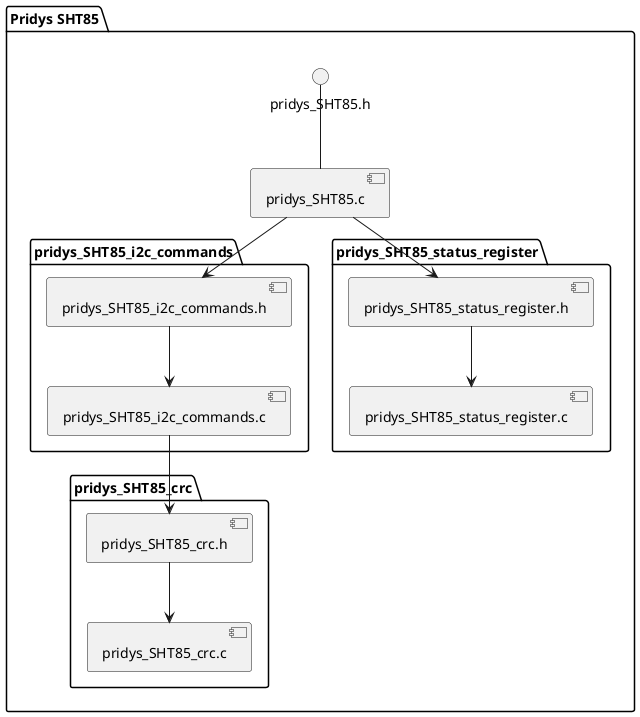

# vsc_idf_ESP32_CompSHT85_CompNVM
## Pridys SHT85 - I2C Commands
###### Submodule of pridys_SHT85 component
Purpose is to encapsulate I2C communication towards sensor SH85. 

```plantuml
@startuml

package "Pridys SHT85" {
    pridys_SHT85.h -- [pridys_SHT85.c]

    package "pridys_SHT85_i2c_commands" {
        [pridys_SHT85_i2c_commands.c]
        [pridys_SHT85_i2c_commands.h]
    }

    package "pridys_SHT85_crc" {
        [pridys_SHT85_crc.c]
        [pridys_SHT85_crc.h]
    }

    package "pridys_SHT85_status_register" {
        [pridys_SHT85_status_register.c]
        [pridys_SHT85_status_register.h]
    }

}

[pridys_SHT85.c] -down-> [pridys_SHT85_i2c_commands.h]
[pridys_SHT85.c] -down-> [pridys_SHT85_status_register.h]

[pridys_SHT85_i2c_commands.h] -down-> [pridys_SHT85_i2c_commands.c]
[pridys_SHT85_crc.h] -down-> [pridys_SHT85_crc.c]
[pridys_SHT85_status_register.h] -down-> [pridys_SHT85_status_register.c]

[pridys_SHT85_i2c_commands.c] --> [pridys_SHT85_crc.h]

@enduml
```
